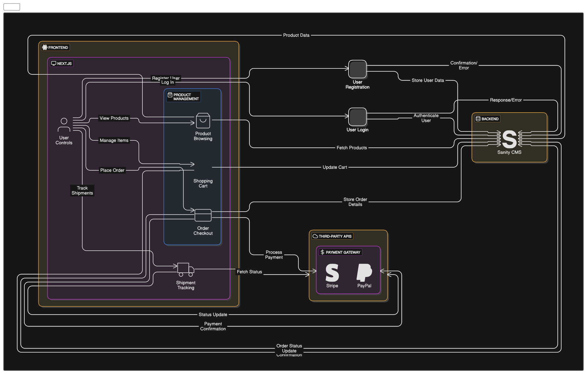

# **Marketplace Technical Foundation - My E-Commerce Marketplace**

## **System Architecture**

### **Overview**

The system architecture consists of the following components:

1. **Frontend**: Built with React or Next.js to provide a responsive, user-friendly interface.
2. **Backend**: Sanity CMS to manage data (products, customers, orders).
3. **Third-Party APIs**: For payment processing and shipment tracking.

### **Diagram**



[View on Eraser](https://app.eraser.io/workspace/SrpsVc29ZMtXUv2i1SkV?elements=XlztNoHNr7mZNN8Jy7s7SQ)

---

## **Key Workflows**

### 1. **User Registration**

- **Step 1**: User enters name, email, and password on the frontend.
- **Step 2**: Data is sent to Sanity CMS and stored as a customer record.
- **Step 3**: A welcome email is sent to the user (optional).

### 2. **Product Browsing**

- **Step 1**: User selects a category (e.g., Casual, Formal).
- **Step 2**: Frontend fetches filtered products from Sanity CMS.
- **Step 3**: Products are displayed with sorting and filtering options.

### 3. **Order Placement**

- **Step 1**: User adds products to the cart.
- **Step 2**: On checkout, order details are sent to Sanity CMS and stored.
- **Step 3**: Payment details are processed via the Payment Gateway.
- **Step 4**: Order status is updated, and the user receives a confirmation.

### 4. **Shipment Tracking**

- **Step 1**: User requests shipment tracking.
- **Step 2**: Frontend fetches the latest status from the Shipment Tracking API.
- **Step 3**: Real-time updates are displayed to the user.

---

## **API Endpoints**

### **Products**

- **Endpoint**: `/products`
- **Method**: GET
- **Description**: Fetch all available products.
- **Response**:

```json
[
  {
    "id": 101,
    "itemName": "Men's Casual T-Shirt",
    "actualPrice": 25,
    "discountedPrice": 20,
    "discountpercent": 20,
    "rating": 4.8,
    "section": "newArrivals",
    "category": ["Casual"],
    "image1": "url_to_image1"
  }
]
```

### **Orders**

- **Endpoint**: `/orders`
- **Method**: POST
- **Description**: Create a new order.
- **Payload**:

```json
{
  "customerId": 1,
  "products": [{ "productId": 101, "quantity": 2 }],
  "totalPrice": 50,
  "paymentStatus": "Paid"
}
```

- **Payload**:

```json
{
  "orderId": 5001,
  "status": "Order Placed"
}
```

### **Shipment**

- **Endpoint**: `/shipment/:id`
- **Method**: GET
- **Description**: Track the status of a shipment.
- **Response**:

```json
{
  "shipmentId": 2001,
  "orderId": 5001,
  "status": "In Transit",
  "expectedDelivery": "2025-01-20"
}
```

## **Sanity Schema**

### **Products Schema**

```javascript
import { defineField, defineType } from "sanity";

export const ProductType = defineType({
  title: "Product",
  type: "document",
  name: "product",
  fields: [
    defineField({
      title: "Product Name",
      type: "string",
      name: "itemName",
    }),
    defineField({
      title: "Product Price",
      type: "number",
      name: "actualPrice",
    }),
    defineField({
      title: "Discounted Product Price",
      type: "number",
      name: "discountedPrice",
    }),
    defineField({
      title: "Discount Percentage",
      type: "number",
      name: "discountpercent",
    }),
    defineField({
      title: "Product Ratings",
      type: "number",
      name: "rating",
    }),
    defineField({
      name: "section",
      title: "Product Section",
      type: "string",
      options: {
        list: [
          { title: "New Arrivals", value: "newArrivals" },
          { title: "Top Sellings", value: "topSellings" },
          { title: "Recommended", value: "recommended" },
        ],
      },
    }),
    defineField({
      name: "category",
      type: "array",
      title: "Product Category",
      of: [{ type: "reference", to: { type: "category" } }],
    }),
    defineField({
      title: "Featured Image 1",
      name: "image1",
      type: "image",
      options: {
        hotspot: true,
      },
    }),
  ],
});
```

### **Category Schema**

```javascript
import { defineField, defineType } from "sanity";

export const CategoryType = defineType({
  name: "category",
  type: "document",
  title: "Product Category",
  fields: [
    defineField({
      name: "category",
      type: "string",
      title: "Product Category",
    }),
  ],
});
```

### **Orders Schema**

```javascript
export default {
  name: "order",
  type: "document",
  fields: [
    {
      name: "customerId",
      type: "reference",
      to: [{ type: "customer" }],
      title: "Customer",
    },
    {
      name: "products",
      type: "array",
      of: [
        {
          type: "object",
          fields: [
            {
              name: "productId",
              type: "reference",
              to: [{ type: "product" }],
              title: "Product",
            },
            { name: "quantity", type: "number", title: "Quantity" },
          ],
        },
      ],
    },
    { name: "totalPrice", type: "number", title: "Total Price" },
    {
      name: "status",
      type: "string",
      options: { list: ["Pending", "Shipped", "Delivered"] },
      title: "Status",
    },
  ],
};
```
